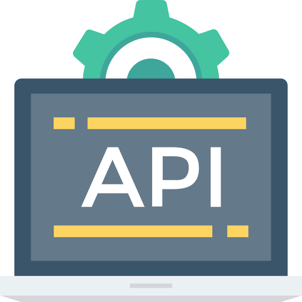

<div align="center">
  <a href="https://github.com/mohammad-siraj/CRUD_API_Golang_MUX">
    
  </a>
  <h3 align="center">CRUD_API_GOLANG_MUX</h3>
  <p align="center">
    CRUD api implementation in golang with gorilla/mux for car database hosted in a dokcer container (Postgres)  
    <br />
    <br />
  </p>
  <p align="left">
  </p>
</div>
<!-- ABOUT THE PROJECT -->

## Running the database container:
To start the docker container for Postgres instance by running the dokcer_compose file in 'dockerfiles/docker_compose.yaml':

```console
CRUD_API\dockerfiles> docker compose -f docker_compose.yaml up
```
## Table schema and Data upload in the container for cars
To upload the table schema and data for cars to  Postgres instance use the bash file in  'database/bash_files':

```console
CRUD_API\dockerfiles\bash_files> bash dataupload.sh
```


## Requirements:
* docker >= 17.12.0+
* docker-compose
* gorilla/mux
* lib/pq

## About The Project
This is a CRUD API written in go lang on a car (params: model,make,year) database hosted in a Docker container running Postgres instance and using gorilla/mux for multiplexing HTTP requests 
